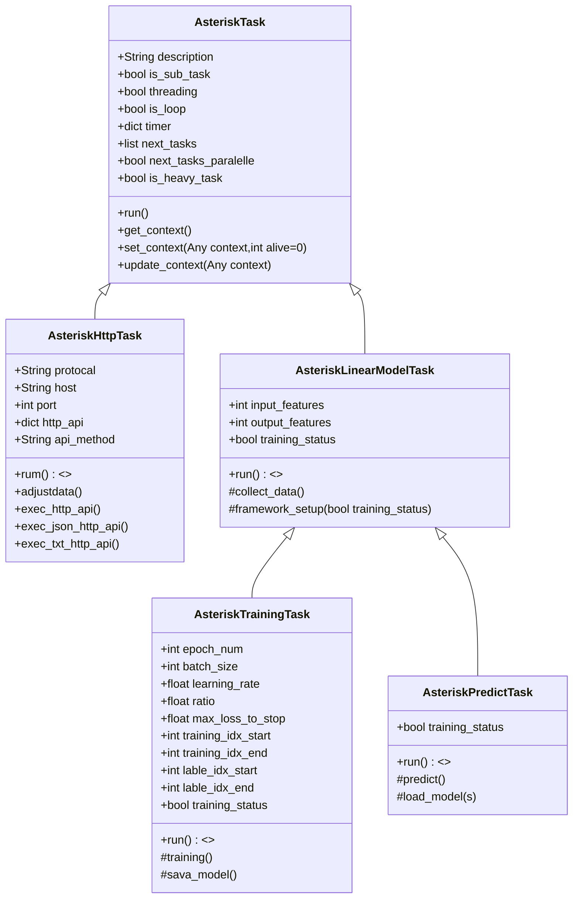
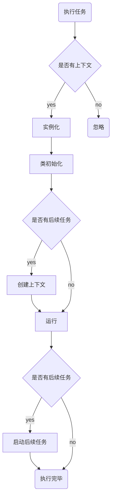
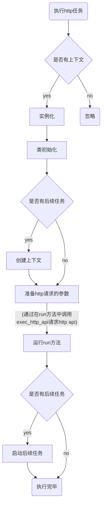

# Asterisk-Task 技术文档

[TOC]

## 摘要

这是一个任务管理的框架，可以把需要执行的任务在命令行进行执行，配置定时任务、多线程运行的任务等。
可以应用到日常监控、自动化执行、数据自动采集、定时自动机器学习等方面。

本框架诞生自2021年，当时在疫情期间，隔离、居家办公的多种工作条件下，需要一个自动换成一些服务端任务的程序。于是就着手写了这个框架。目前这个框架开源在github [asterisk-task](https://github.com/geoshan/asterisk-task)上。

欢迎提交缺陷，以便不断优化改进。

## 安装

提供三种安装方式：

### 从gitee下载whl文件安装

1. 在github的[发行版](https://github.com/geoshan/asterisk-task/releases) 下载最新发行版
2. 可以命令行中执行`pip3 install asterisk_task-*.whl`进行安装

### 源码安装

1. 在gitee中下载源码
2. 在源代码的目录中执行`python3 -m build`
3. 然后执行`pip3 install dist/asterisk_task-*.whl`完成安装

### pypi安装

执行`pip3 install asterisk-task`

* 以pip的方式安装最简单，最推荐。
* __注意__ ：仅支持Python 3.10+ 运行环境，兼容所有操作系统。

## 起步

现在就来创建您的第一个任务工程：

1. 安装成功后,可以使用命令行创建项目，例如创建test_project `atnewapp -app test_project`
2. 系统会自动创建 `test_project` 目录，以及`run_test_project.py`
3. 执行`python3 run_test_project.py`即可启动项目运行。创建项目时会自动设置默认任务。

## 软件架构

Aterisk-Task以TaskManager作为任务管理器的类，在系统启动时，读入配置文件，读取可以调用任务类，启动默认任务，并启动定时任务。本框架集成了schedule、logging等常用类库。

为了解决关联任务之间的数据传递，以AsteriskContext来实现了类似cookie的功能。

自V2.0以后，任务类做了一次比较大的升级。任务类（除了启动后的默认任务，需要在AppConfig文件中配置意外）将不需要在配置文件中进行配置。

### TaskManager

整个框架以`TaskManager`为核心，项目工程启动后，所有的任务都由其启动任务执行。`TaskManager`具体实现线程任务、循环任务等特性

### Task

* 只有继承自`AsteriskTask`的class，才可以被`TaskManager`调用执行
* 所有的Task需要写在tasks.py中，或者tasks目录中

### 工程启动后预装Task

工程启动后，系统会把所有的Task类装载到内存容器中，当有需要调用时，从容器中取出类，交有`TaskManager`执行调用。

## 教程

通过几个典型的例子，作为一个教程，可以快速了解架构，以及创建任务工程之后的长期的维护。有关任务的详细文档，请参阅[任务](#tasks)部分

### 一个简单的任务

在前文中，我们通过命令行创建了一个工程test_project，在`test_project`目录中，有个系统生成的`tasks.py`文件，有一段Demo的Task

```python

class AsteriskDemoTask(AsteriskTask):
    '''
    一个基于第二代任务的默认演示任务
    '''
    description = 'First demo task for Asterisk Task V2'
    def run(self):
        success_print('您已经成功创建项目，并运行在Asterisk-Task第二代框架V{}之上'.format(AppConfig['version']))

```

这就是一个典型的任务。任务类的`run()`方法将被`TaskManager`自动调用执行。

_Tips_:

1. 所有的Task类都需要写类注释，否则不执行调用
2. 类属性`description`将出现工程启动时的命令表上，请参阅[命令行](#cl)章节
3. `AppConfig`参见[AppConfig说明](#app_config)

### 默认任务

默认任务指的是工程启动后，系统自动启动的任务。默认任务的设定，在`AppConfig.json`文件(参见[AppConfig说明](#app_config))中`default_task`进行设定。

### 初始化任务

初始化任务是指，工程启动后，系统自动执行的任务。初始化任务的设定，在`AppConfig.json`文件(参见[AppConfig说明](#app_config))中`init_task`进行设定。该任务只会执行一次。工程重新启动后，不会再执行初始化任务。主要用于类似数据库表结构的初始化工作等。

### 定时任务

定时任务通过类属性`is_loop`作为开关。默认值为`False`，当定义为`True`时，开启循环任务，循环配置在`timer`属性中。参考以下例程：

```python
class AsteriskTimerTask(AsteriskTask):
    '''
    一个基于第二代任务的定时演示任务
    '''
    description = 'First demo task with timer for Asterisk Task V2'
    is_loop = True
    timer = {
        'period': 10,
        'fixed_time':['21:24']
    }
    def run(self):
        success_print('第二代定时任务，运行在Asterisk-Task V{}之上'.format(AppConfig['version']))
        success_print('定时任务执行完成')


```

其中`period`代表每隔多少秒循环执行一次。如果为0，则代表按照定时任务，由`fixed_time`定义的每日的21:24执行。详细请参阅[定时设置](#ds)

### 线程任务

线程任务指的是运行在多线程中任务，当有其他任务执行时，与之并行执行。请参考以下例程：

```python
class TestThreadTask(AsteriskTask):
    """
    用于测试多线程任务
    """
    threading = True

    def run(self):
        i=0
        while (i< 10):
            info_print(f'测试多线程，等待{i}')
            sleep(1)
            i+=1
```

当类属性`threading`为`True`时，表示该任务为多线程任务。

_Tips_:

* 所有的定时任务都会以多线程方式运行

### 子任务

子任务一般依赖于主任务执行的结果而运行。在类属性`is_sub_task`为`True`时，即设定为子任务。子任务的调用，需要由主任务的设定的类属性`next_tasks`来定义。`TaskManager`会自动在主任务执行完毕后按照顺序启动子任务。

```python
class TestMainTask(AsteriskTask):
    """
    用于测试主任务
    """
    next_tasks = ['TestSubTask']

    def run(self):
        success_print('第二代主任务启动，运行在Asterisk-Task V{}之上'.format(AppConfig['version']))
        success_print('主任务执行完成')

class TestSubTask(AsteriskTask):
    """
    用于测试子任务
    """
    is_sub_task = True

    def run(self):
        success_print('第二代子任务启动，运行在Asterisk-Task V{}之上'.format(AppConfig['version']))
        success_print('子任务执行完成')

```

_Tips_:

* 子任务可以调用起其他子任务，形成任务串。注意不要形成死循环。

## 任务 <a name='tasks'></a>

所有的任务都必须继承`AsteriskTask`类，由于很多定时任务都是通过http api获取数据，因此我们扩展了`AsteriskHttpTask`[^1]类。获取数据后，很多情况下需要进行AI训练，自V2.2.2版起，增加了线性回归模型的训练与预测的任务支持，下面将逐一说明一下。

### 类图



[^1]:这是第二代的通过http api获取数据的任务类。

### `AsteriskTask`

当`TaskManager`调用任务类时，先将任务类实例化，然后执`run()`方法。流程如下：



#### AsteriskTask 类属性

以下整理了类的属性：

|名称|数据类型|默认值|说明|备注|
|:---|:---|:---:|:---|:---|
|description|string|空|任务的简要说明|将显示在help表格中|
|is_sub_task|bool|False|是否是子任务,如果是，则无法独立运行，需要在主任务中调用|子任务将不再help表格中显示|
|threading|bool|False|是否使用多线程| |
|is_loop|bool|False|是否循环执行，定时任务的设定，首先要设定is_loop为True| |
|timer|dict|null|定时器的设置，只有在is_loop为True时才有效。period为间隔时间，fixed_time为固定时间,有关其他定时设置，请参阅[定时设置](#ds)| |
|next_tasks|tuple|null|后续任务[^2]|子任务只能通过这里调用|
|next_tasks_paralelle|bool|False|当设定为抽象任务时，不作为具体任务执行。必须有子类的任务才能执行任务。并行的好处是，以多线程的方式执行，可以提高任务的执行效率。同时可以快速释放主任务的内存。| |
|is_heavy_task|bool|False|是否是重量级任务，如果是，则需要考虑任务的执行时间，以及任务的执行效率.目前的设计是，如果是重量级任务，则需在任务执行结束后，释放内存。调用系统的clear方法，清除内存。||
|hidden_task|bool|False|是否隐藏任务，隐藏的任务将不会显示在help表格中|在命令行中依然可以调用（V2.2.2开始支持）|

[^2]:后续任务可以是主任务，也可以是子任务，但子任务必须从后续任务这里启动

##### 定时设置<a name="ds"></a>

关于定时任务的设置，详细说明如下表：

|关键字|说明|示例|
|:---:|:---|:---|
|fixed_time|每日固定时间，时间点可以有多个|“fixed_time":["16:15"]|
|workday|中国工作日固定时间，时间点可以有多个|"workday":["16:15"]|
|business_day|交易日（特指中国证券市场交易日）固定时间，时间点可以有多个|"business_day":["16:15"]|
|weekly|每周固定时间，时间点可以有多个|"weekly":\[[0,"16:15"],[2,"16:15"]] 代表每周一和周三的下午4:15. _提示_:两组数组中，第一数字表示星期几，0代表周一，以此类推；第二个为时间点。|

#### AsteriskTask 类方法

以下为类方法：

<table>
    <tr>
        <th>类方法名</th><th>参数说明</th><th>方法说明</tdh><th>备注</th>
    </tr>
    <tr>
        <td>run()</td><td>无参数</td><td>执行任务的具体内容,如果有后续任务，需要保存数据到上下文的，需要在此方法内调用set_context()</td><td></td>
    </tr>
    <tr>
        <td>get_context</td><td>无参数</td><td>获取上一个任务执行时保存的上下文</td><td>一般在run()方法内调用</td>
    </tr>
    <tr>
        <td rowspan=2>set_context</td>
        <td>context:需要保存到上下文的数据，可以是任何数据格式</td>
        <td rowspan=2>设置上下文内容，以便于后续任务调用</td>
        <td rowspan=2></td>
    </tr>
    <tr>
        <td>alive: 上下文保存的时间，单位为秒（整数）</td>
    </tr>
    <tr>
        <td>update_context</td><td>context:需要保存到上下文的数据，可以是任何数据格式</td><td>更新上下文内容，以便于后续任务调用</td><td>V2.2.2开始支持</td>
    </tr>
</table>

### AsteriskHttpTask

AsteriskHttpTask基于AsteriskTask扩展了对http api获取数据的能力，对于大数据业务处理，深度学习与模型训练有极大的帮助。我们需要先了解以下UML类图。

其任务执行的流程如下：



#### AsteriskHttpTask类属性

以下整理了类属性

|名称|数据类型|默认值|说明|备注|
|:---|:---|:---:|:---|:---|
|protocal|string|https://|http api的协议|默认为https|
|host|string|空|主机名，域名或者IP地址||
|port|int|443|端口号，对应默认协议||
|http_api|dict|空|api的具体说明参阅[http_api详细说明](#http_api)||
|api_method|string|空|当前类的api的方法名,在父类中定义多个api method，相当于默认的api method，可以在子类中通过api_method来指定||

##### http_api详细说明 <a name="http_api"></a>

以下是http_api的范例，该范例是访问gitee http api的例子。其由一个或者多个api method组成。

```json
{
    "access_token": {
        "method":"post",
        "path":"/oauth/token",
        "Content-Type":"application/x-www-form-urlencoded",
        "data": {
            "grant_type":"password",
            "username":"abc@abc.com",
            "password":"xxx",
            "client_id":"fabb2eb**************************************3f289",
            "client_secret":"712301**************************************b6f2",
            "scope":"user_info projects pull_requests issues notes keys hook groups gists enterprises"
        }
    }
}
```

api method:
: 名称定义后，包含多个预定义的字段(method,path,Content-Type,data)
: method - 为http的请求方法，一般为post和get
: path - 具体路径
: Content-Type - post和get均可以使用"application/x-www-form-urlencoded"，其他可以自己定义
: data - 这里是自定义的数据，形式为key/value 的格式。

#### AsteriskHttpTask类方法

这里主要说明新增的方法：

|方法名|参数说明|方法说明|备注|
|:---:|:---|:---|:---:|
|adjustdata()|无参数|该方法在__init__()中调用，故会在run()之前运行，为run()方法准备必要的数据，这对需要进行http api获取数据非常必要||
|exec_http_api()|无参数|该方法需要在run()中调用，根据任务的具体需要来执行。|所有执行http 请求的参数应在adjustdata()方法中设定|
|exec_json_http_api()|无参数|该方法与exec_http_api()类似，差别在于返回json格式数据||
|exec_txt_http_api()|无参数|该方法与exec_http_api()类似，差别在于返回txt格式数据||

### AsteriskLinearModelTask

AsteriskLinearModelTask是线性回归模型的基类，其继承自AsteriskTask。V2.2.2开始支持。

#### AsteriskLinearModelTask类属性

以下整理了类属性

|名称|数据类型|默认值|说明|备注|
|:---|:---|:---:|:---|:---|
|input_features|int|0|输入特征的数量||
|output_features|int|0|输出特征的数量||
|training_status|bool|False|是否是训练模型||

#### AsteriskLinearModelTask类方法

以下整理了类方法

|方法名|参数说明|方法说明|备注|
|:---|:---|:---|:---:|
|framework_setup|bool|False|模型的训练准备工作|
|collect_data|无参数|该方法需要在run()中调用，根据任务的具体需要来执行。|注意：training_data,test_data这两个对象属性在init方法中通过该方法获得赋值|

### AsteriskTrainingTask

AsteriskTrainingTask是线性回归模型的训练任务，其继承自AsteriskLinearModelTask。V2.2.2开始支持。

#### AsteriskTrainingTask类属性

以下整理了类属性

|名称|数据类型|默认值|说明|备注|
|:---|:---|:---:|:---|:---|
|epoch_num|int|100|训练的轮数||
|batch_size|int|100|训练的批次||
|learning_rate|float|0.01|学习率||
|ratio|float|0.8|训练集的比例||
|max_loss_to_stop|float|0.0001|最大损失值||
|training_idx_start|int|0|训练集的起始位置||
|training_idx_end|int|0|训练集的结束位置||
|lable_idx_start|int|0|标签的起始位置||
|lable_idx_end|int|0|标签的结束位置||

#### AsteriskTrainingTask类方法

以下整理了类方法

|方法名|参数说明|方法说明|备注|
|:---|:---|:---|:---:|
|training|无参数|对准备好的数据进行训练|该方法需要在run()中调用，根据任务的具体需要来执行。|
|save_model|无参数|保存训练好的模型|该方法需要在run()中调用，根据任务的具体需要来执行。|

### AsteriskPredictTask

AsteriskPredictTask是线性回归模型的预测任务，其继承自AsteriskLinearModelTask。V2.2.2开始支持。

#### AsteriskPredictTask类属性

以下整理了类属性

|名称|数据类型|默认值|说明|备注|
|:---|:---|:---:|:---|:---|
|training_status|bool|False|是否是训练模型|这里默认为否|

#### AsteriskPredictTask类方法

以下整理了类方法

|方法名|参数说明|方法说明|备注|
|:---|:---|:---|:---:|
|predict|无参数|对给定的条件的数据进行预测|该方法需要在run()中调用，根据任务的具体需要来执行。|
|load_model|无参数|加载模型|该方法需要在run()中调用，根据任务的具体需要来执行。|

## ORM支持

自V2.2.0版起，基于SqlAlchemy，支持ORM的方式来管理数据库。Asterisk在SqlAlchemy的基础上，提供了一些简单的操作，方便开发人员使用。

### 扩展特性

Asterisk在SqlAlchemy的基础上，做了一些扩展特性，目的是体现Asterisk的一些关于数据库的思想：

1. <b>数据得来不易，不要轻易删除。</b>所有的表都有一个is_deleted字段，用于标识该条数据是否被删除，这样就便于做软删除。
2. <b>数据要留下基本的记录。</b>所有的表都有一个create_time字段和update_time，用于标识该条数据的创建时间和最后更新时间，这样就便于做数据的追溯。
3. <b>不要轻易做外键关联。</b>应尽量做逻辑的外键关联。很多的ORM的软件都忠于数据库厂商的设计，这样会导致数据查询的性能问题。在V2.2.0版本中暂时还没有实现这个特性。会在以后的版本中实现。

#### 默认表字段

为简化开发人员的工作量，在定义表时，会自动生成以下字段：

|字段名|类型|说明|备注|
|:---|:---|:---|:---:|
|id|int|主键|自增|
|create_time|datetime|创建时间|自动生成|
|update_time|datetime|更新时间|自动生成|
|is_deleted|int|是否删除|0表示未删除，1表示已删除|

举例如下

```python
from asterisktask.lib.orm import AsteriskModel
from sqlalchemy import String,ForeignKey
from sqlalchemy.orm import Mapped,relationship,mapped_column,DeclarativeBase
from typing import List

class Users(AsteriskModel):
    __tablename__ = 'users'
    username: Mapped[str] = mapped_column(String(255),unique=True)
    password: Mapped[str] = mapped_column(String(32))
    email: Mapped[str] = mapped_column(String(255))
    user_codes: Mapped[List["UserCodes"]] = relationship(back_populates="user",cascade="all, delete-orphan")
    def __repr__(self) -> str:
        return f'<{self.username!r} User>: id={self.id!r}, email={self.email!r}'
```

通过集成AsteriskModel类，我们可以很方便的定义表，而不需要自己定义主键，创建时间，更新时间，是否删除等字段。

#### select默认返回未删除的数据

Asterisk改写了SqlAlchemy的select方法，使得select方法默认返回未删除的数据。

举例如下

```python
from spc.models import Exchange
from sqlalchemy import create_engine
from asterisktask.lib.orm import AsteriskSession as Session,select
engine = create_engine('sqlite:///data/exchange.db')

with Session(engine) as session:
    stmt = select(Exchange)
    for exchange in session.scalars(stmt):
        print(exchange)
success_print('查询完成')

```

语法结构与直接使用SqlAlchemy的select方法一致。区别在于需要使用AsteriskSession来代替SqlAlchemy的Session和scalars方法。

#### 表数据的软删除

Asterisk改写了SqlAlchemy的delete方法，使得delete方法实际只是将is_deleted字段设置为1，而不是真正的删除数据。

举例如下

```python

from asterisktask.lib.orm import AsteriskSession as Session
from spc.models import Exchange,Session as SqlSession
from sqlalchemy import create_engine
engine = create_engine('sqlite:///spc.db',echo=False)
with Session(engine) as session:
    exchange = session.query(Exchange).filter(Exchange.abbreviation=='SH').all()
    session.delete(exchange)
    session.commit()
success_print('删除完成')
```

语法结构与直接使用SqlAlchemy的delete方法一致。区别在于需要使用AsteriskSession来代替SqlAlchemy的Session和delete方法。

当然也可以直接使用asterisktask.lib.orm包里的delete函数，效果与直接使用AsteriskSession的delete方法一致。

### 数据库相关配置

目前在AppConfig中没有增加固定的配置，但可以自定义配置。
以下是一个范例：

```json
"data_sources":{
    "mysql":{
        "driver":"pymysql",
        "host":"localhost",
        "port":3306,
        "user":"spc",
        "password":"USUHoeZB6OTaJZtEx4KEu22IC7snM816OUkGsFvoGERdpE+N8Slh/rLDjQYRWPQ26cN5HZcpAlkE8cbYskqPtg==",
        "database":"spc"
        },
    "sqlite":{
        "description":"sqlite数据源",
        "path":"data",
        "filename":"spc.db"
        }
    
},
"data_source":"mysql"
```

Asterisk-Task会在后续版本中增加固定的配置，以方便用户使用。

### 类与函数说明

## 工程配置

在运行`atnewapp`命令后生成的同名目录中，软件为工程自动生成了一个配置文件AppConfig.json文件

### AppConfig说明 <a name="app_config"></a>

|字段名|自动生成|默认值|必需|说明|备注|
|:---|:---:|:---:|:---:|:---:|:---|
|app_name|Y|根据命令自动生成|Y|工程名称||
|app_description|Y|根据命令自动生成|N|工程说明|建议工程生成后自行修改完整说明|
|app_author|Y|Unknown|N|工程作者|建议工程生成后自行修改|
|app_email|Y|unknown@abc.com|N|联系电邮地址|建议工程生成后自行修改|
|task_module|Y|根据命令自动生成|Y|任务类所在的模块位置|在不熟悉本框架前不建议修改|
|default_task|Y|根据命令自动生成|Y|任务启动后的默认调用任务|建议工程生成后自行修改|
|init_task|Y|根据命令自动生成|Y|工程启动后的初始化任务|建议工程生成后自行修改,该任务只执行一次，主要用于工程启动后建立表结果等一次性setup的任务，自V2.2.0版后支持|
|app_version|Y|0.0.1|Y|工程版本号|建议工程生成后自行修改|
|prompt|Y|根据命令自动生成|Y|可根据需要修改||
|connection_timeout|Y|30|Y|http请求的超时限制，默认为30秒|建议不要修改|
|tasks|Y|自动生成范例|Y|见[tasks配置说明](#tasks)|后续版本将不断优化调整|
|version|N|Asterisk-Task的版本|Y|Asterisk-Task的版本号，依据安装的包的版本|内置属性不可修改|
|debug|N|1|Y|工程的debug状态，来决定是否输出dprint()的内容|软件正式发布时可修改为0|
|log|N|使用Asterisk-Task默认配置|Y|日志的配置信息，详见[日志](#log)||
|logo_text_file|N|使用Asterisk-Task默认配置|Y|可在AppConfig.json所在目录添加logo.attpl文件，详见[制作logo文件](#logo)||
|title_text_file|N|使用Asterisk-Task默认配置|Y|可在AppConfig.json所在目录添加title.attpl文件，详见[制作logo文件](#logo)||
|errors|N|使用Asterisk-Task默认配置|Y|错误的定义，主要是针对http api的连机错误,详见[error定义](#errors)|如自定义后，默认定义将被覆盖|

### AppConfig的默认配置参数

|字段名|默认值|说明|备注|
|:---|:---:|:---:|:---:|
|version|Asterisk-Task的版本|Asterisk-Task的版本号，依据安装的包的版本|内置属性不可修改|
|dist_type|dev|当然版本的状态，dev代表开发版；RC代表Release Candidate。空代表正式版|内置属性不可修改，V3.0以后才提供|
|debug|1|工程的debug状态，来决定是否输出dprint()的内容|软件正式发布时可修改为0|
|prompt|Asterisk-Task运行后的提示符|可根据需要修改||
|log|使用Asterisk-Task默认配置|日志的配置信息，详见[日志](#log)|建议不要修改|
|log_level|DEBUG|日志的级别|DEBUG,INFO,WARNING,ERROR,CRITICAL|
|log_file|asterisk.log|日志文件的名称|建议不要修改|
|connection_timeout|30|http请求的超时限制，默认为30秒|建议不要修改|
|logo_text_file|使用Asterisk-Task默认配置|可在AppConfig.json所在目录添加logo.attpl文件，详见[制作logo文件](#logo)|建议不要修改|
|title_text_file|使用Asterisk-Task默认配置|可在AppConfig.json所在目录添加title.attpl文件，详见[制作logo文件](#logo)|建议不要修改|
|errors|使用Asterisk-Task默认配置|错误的定义，主要是针对http api的连机错误,详见[error定义](#errors)|如自定义后，默认定义将被覆盖|

#### tasks配置说明<a name="tasks"></a>

以下是一个范例

```json
"tasks":{
        "default_task":{
            "description":"Asterisk-Task 默认任务",
            "task_class":"AsteriskTestTask"
        },
        "test_thread_task":{
            "description":"测试多线程任务",
            "task_class":"TestThreadTask",
            "threading":1,
            "use_api":0
        }
    }

```

由于这是为兼容Asterisk-Task V1.X而保留的，这里不做详细介绍


#### 如何制作logo文件 <a name="logo"></a>

由于本软件为命令行工具，并没有UI，所以logo是由字符组成的图案，即ASCII Art，可以借助Asc ii Art生成网站(例如： [http://patorjk.com/software/taag/](http://patorjk.com/software/taag/))，生成文字图案，然后以纯文本方式保存在logo.attpl文件中。

`title_text_file`也是同理，其预先定义的文本文件名为：`title.attpl`

以下是默认logo的文字图案：

```txt
_______       _____            _____       ______        ________             ______  
___    |________  /_______________(_)_________  /__      ___  __/_____ __________  /__
__  /| |_  ___/  __/  _ \_  ___/_  /__  ___/_  //_/________  /  _  __ `/_  ___/_  //_/
_  ___ |(__  )/ /_ /  __/  /   _  / _(__  )_  ,<  _/_____/  /   / /_/ /_(__  )_  ,<   
/_/  |_/____/ \__/ \___//_/    /_/  /____/ /_/|_|        /_/    \__,_/ /____/ /_/|_|  
                                  
```

_Tips_:

* logo.attpl这个文件名是预先定义的，如不想用这个名称，可以在AppConfig.json中自定义
* title.attpl也是同理
  
#### error定义 <a name="errors"></a>

详见下表

|错误代码|错误描述|备注|
|:---:|:---|:---:|
|404|服务器接口不存在 ，请请确认服务器配置后再试。||
|500|服务器接口不存在 ，或者http api的方法不支持|可检查日志文件|
|504|ConnectTimeout -- 请稍后再试|可检查网络配置|
|501|服务器可能未启动 ，请稍后再试。|检查网络配置|
|502|无法连接服务器 ，请稍后再试。|检查网络配置|
|503|ChunkedEncodingError -- 请稍后再试|可能网络繁忙，或者处于弱信号环境下|
|509|Unfortunately -- 请稍后再试|可能一些其他未知错误，可检查日志文件等，排查具体故障|

### setting.py的作用

这个文件的用途是在软件工程启动前，将配置信息预先装载到工程中。该文件由命令自动生成，请开发者不要修改`setting.py`文件。

__提示__:
后期Asterisk-Task框架将进行优化，后续某个版本可能不再生成这个文件。

### 日志<a name="log"></a>

默认日志的配置信息如下：

```json
 "log":{
        "log_level":"DEBUG",
        "log_path":"{App}/log",
        "log_file_name":"%Y-%m-%d",
        "log_format":"%(asctime)s - %(levelname)s - %(message)s"
    }
```

详见配置请参考`python`内置工具[logging](https://docs.python.org/3/library/logging.html#module-logging)在线文档

## 命令行<a name="cl"></a>

Asterisk-Task本身是一个基于命令行的任务管理软件，其工程生成也是基于命令。

### 工程生成

命令：atnewapp

|参数|别名|必需|默认值|说明|备注|
|:---:|:---:|:---:|:---:|:---|:---:|
|-app|P|Y|asterisk-demo|新工程名称|如果不使用参数，就使用默认值|

### 工程命令

#### python3 启动工程命令

启动命令的格式如下：

```bash
usage: python3 run_xxxx.py [-h] [-daemon G] [-debug D]

XXXX应用的命令行入口参数

options:
  -h, --help  show this help message and exit
  -daemon G   -daemon=True时，适用在后台守护进程运行，降低CPU占用率。
  -debug D    -debug=True时将打印调试信息，即执行dprint()；默认为True,即打印调试信息。
```

__注意:__

* -gui 参数暂时没有实现GUI，预计后期将

#### 软件内置命令

启动工程后，会出现工程自定义提示符。系统内置了一些命令，可以通过键入`help`命令显示，具体如下表：

|命令|别名|说明|备注|
|:---:|:---:|:---|:---:|
|help||帮助命令，打印命令表||
|exit|:q 或者exit()|推出系统||
|version|version()|显示工程版本信息 |非Asterisk-Task的版本|
| ctrl + C||取消正在执行的任务|会与系统命令行出现冲突，谨慎使用|
|start_schedule_tasks||开启定时任务|一般启动工程后会自动启动定时任务|
|stop_schedule_tasks||关闭定时任||

#### 工程自定义命令

在tasks模块中继承`AsteriskTask`类的任务类，都自动成为工程自定义命令，可以通过键入`help`命令显示查看。

## 招募

招募合作者，有意者请电邮`geoshan@163.com`

### 合作开发

一起合作开发，一起推动框架发展.

### 自动化测试

协助撰写自动化测试案例和脚本
